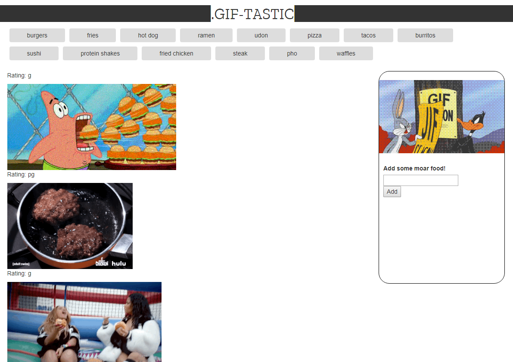

# GifTastic

## Overview
1. This web page populates with gifs provided by GIPHY API.

2. Users can add new topics to search in addition to buttons with pre-defined search terms.

3. When a user clicks a button, non-animated gif images from the GIPHY API are placed on the page.

4. Under every gif, a parental rating is also displayed.

## DEMO
[https://kiddmit3.github.io/GifTastic](https://kiddmit3.github.io/GifTastic)

## Technologies
+ Node.js
+ npm packages (Request)
